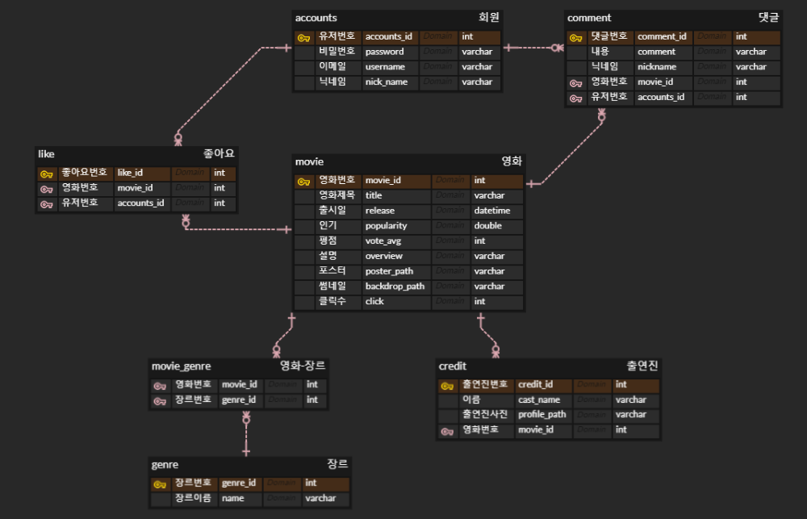
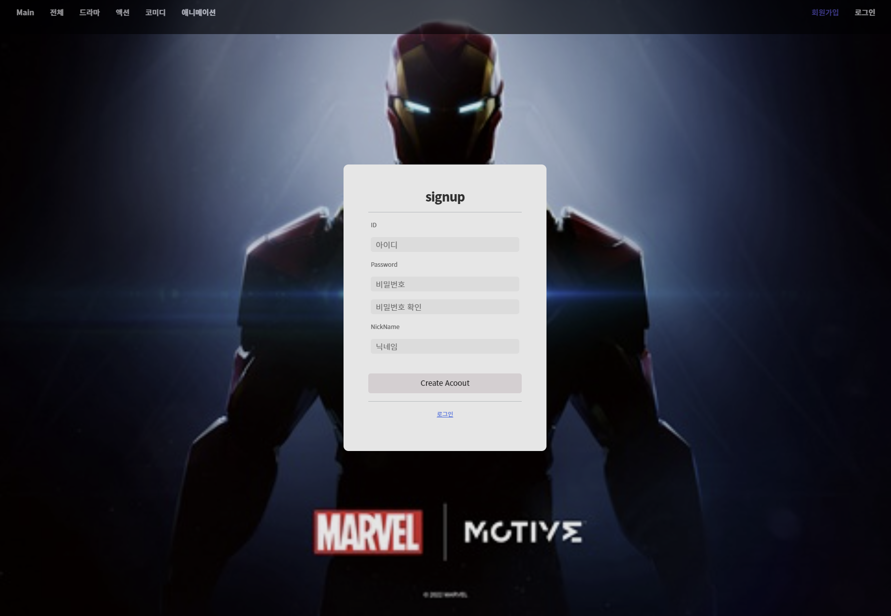
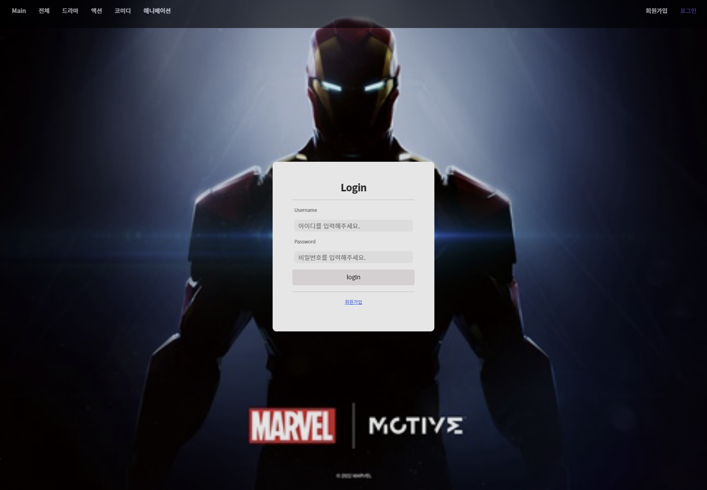
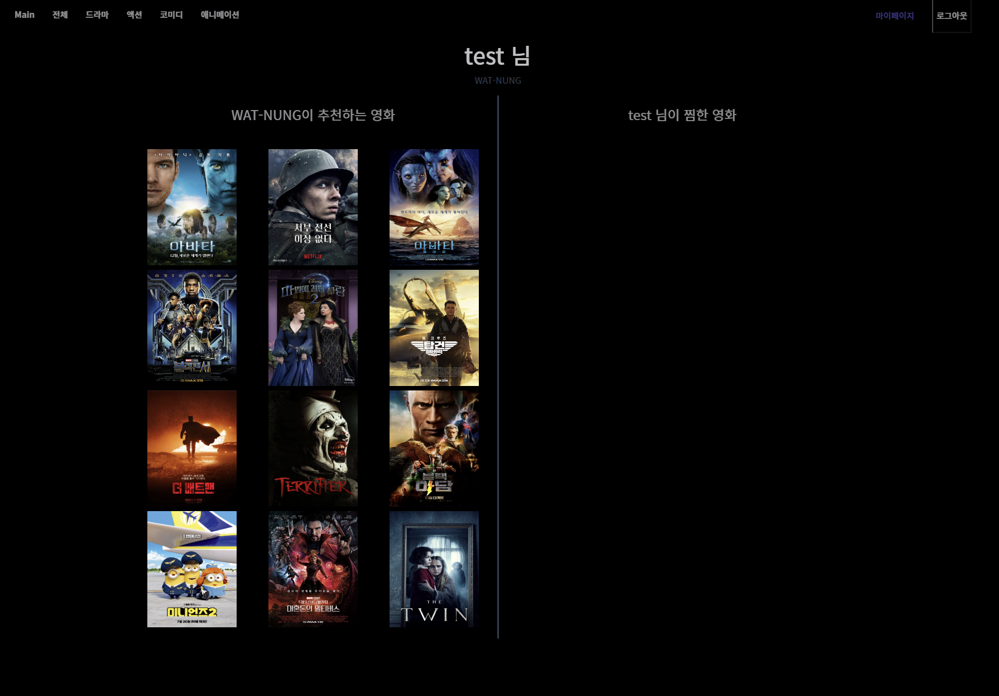
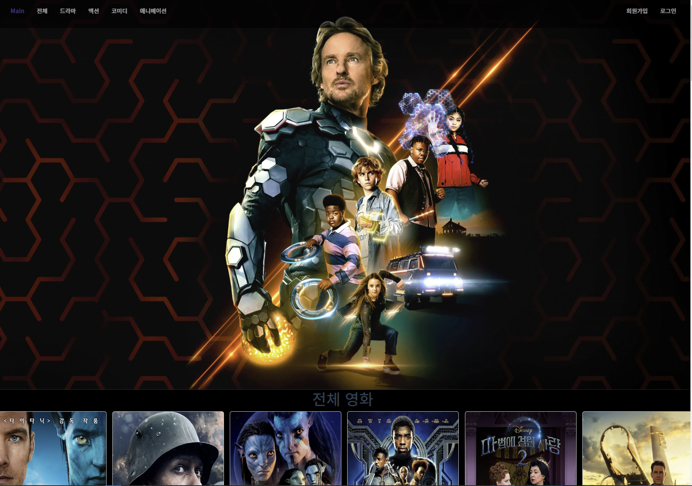
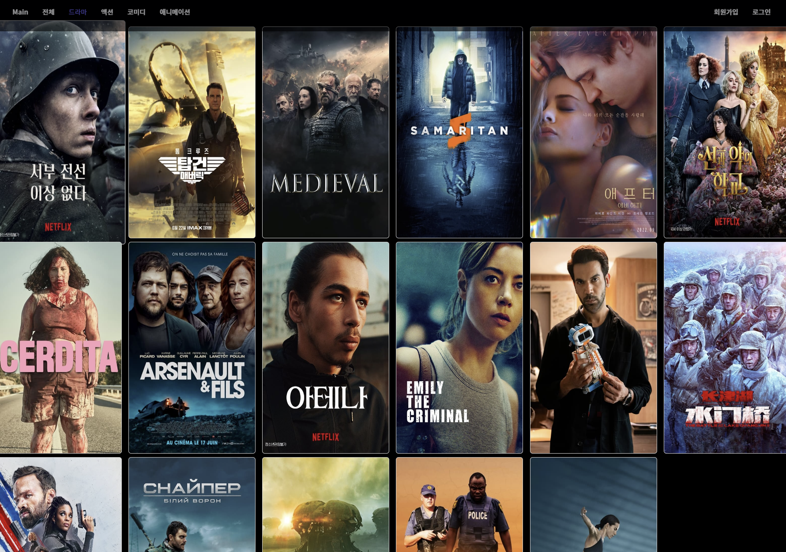
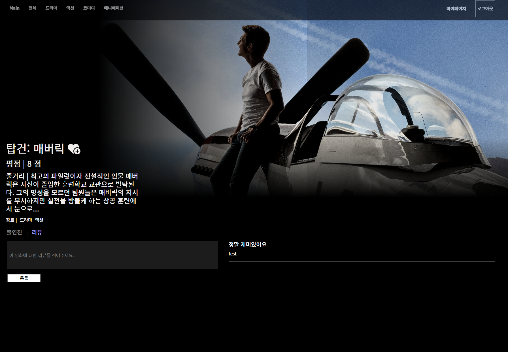
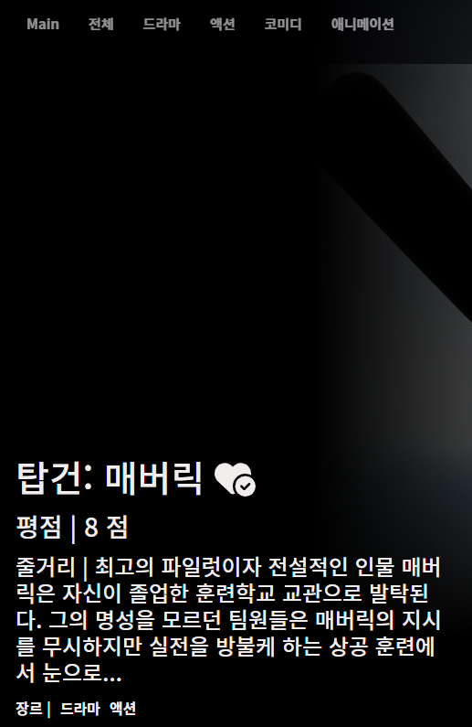
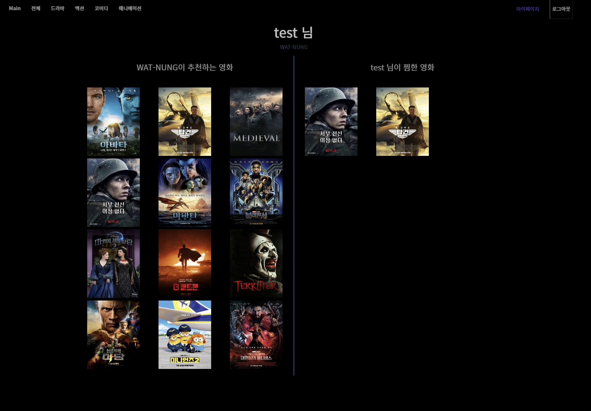

# 영화 추천 페이지(What-Nung)

# 프로젝트 개요

- What-Nung은 사용자들이 다양한 영화를 추천받고 영화를 선택하는 데 도움을 주기 위해 개발된 영화 추천 프로젝트입니다. 사용자의 영화 시청 경험을 향상시키고 다양한 영화를 접할 수 있는 기회를 제공하여 영화를 좋아하는 사람들이 더 많은 영화를 경험하고 즐길 수 있도록 목적으로 서비스를 제공합니다.

## 프로젝트 기간

- 2022.11.16 ~ 2022.11.25

## 프로젝트 참여 인원

- 나혜승(팀장)

- 양동민(팀원)

## 팀원 정보 및 업무 분담 내역

- 나혜승 → 웹사이트 기획 및 프로토타이핑/Vue를 통한 FrontEnd 화면 설계
- 양동민 → Django BackEnd 서버 구축 및 Vue를 통한 FrontEnd 화면 설계

## 기술스택

- JavaScript, Python, SQLite, Django, Vue

# 프로젝트 설계

## 데이터 수집

- [The Movie DataBase(TMDB)](https://www.themoviedb.org/?language=ko) 사이트의 API를 통해 더미 데이터를 json 파일로 생성하여 진행
- TMDB에서 인기순으로 영화 데이터 수집

```
[
	{
		"model": "tmdb_json.movie",
		"pk": 502356,
		"fields": {
			"movie_id": 502356,
			"title": "슈퍼 마리오 브라더스",
			"released_date": "2023-04-05",
			"popularity": 9065.306,
			"vote_avg": 7.5,
			"overview": "따단-딴-따단-딴 ♫ 전 세계를 열광시킬 올 타임 슈퍼 어드벤처의 등장! 뉴욕의 평범한 배관공 형제 '마리오'와 ‘루이지’는 배수관 고장으로 위기에 빠진 도시를 구하려다 미스터리한 초록색 파이프 안으로 빨려 들어가게 된다. 파이프를 통해 새로운 세상으로 차원 이동하게 된 형제. 형 '마리오'는 뛰어난 리더십을 지닌 '피치'가 통치하는 버섯왕국에 도착하지만 동생 '루이지'는 빌런 '쿠파'가 있는 다크랜드로 떨어지며 납치를 당하고 ‘마리오’는 동생을 구하기 위해 ‘피치’와 ‘키노피오’의 도움을 받아 '쿠파'에 맞서기로 결심한다. 그러나 슈퍼스타로 세상을 지배하려는 그의 강력한 힘 앞에 이들은 예기치 못한 위험에 빠지게 되는데...!",
			"poster_path": "/dI81AEA2ua6RfkRAhY7g7xThroL.jpg",
			"genres": [
				16,
				12,
				10751,
				14,
				35
			],
			"backdrop_path": "/9n2tJBplPbgR2ca05hS5CKXwP2c.jpg",
			"click": 0
		}
	},
  ....
]
```

- 수집한 영화 데이터에 따른 장르 데이터 수집

```python
[
	{
		"model": "tmdb_json.genre",
		"pk": 28,
		"fields": {
			"genre_id": 28,
			"name": "액션"
		}
	},
  ...
]
```

- 수집한 영화 데이터의 감독 데이터 수집

```python
[
	{
		"model": "tmdb_json.credit",
		"fields": {
			"credit_id": 502356,
			"cast_name": "Chris Pratt",
			"profile_path": "/83o3koL82jt30EJ0rz4Bnzrt2dd.jpg"
		}
	},
	...
]
```

## Model ERD



# 프로젝트 구현

## 프로젝트 실행

- 백엔드(Django) tmdb_json폴더
  ```bash
  $ python manage.py makemigrations
  $ python manage.py migrate
  $ python manage.py loaddata tmdb_json/fixtures/credits.json tmdb_json/fixtures/genres.json tmdb_json/fixtures/movies.json
  $ python manage.py runserver
  ```
- 프론트엔드(Vue) front_end폴
  ```bash
  $ npm run serve
  ```

## 서비스 기능

1. 회원 정보 관리 & My page
2. 영화 정보
3. 댓글 & 좋아요 기능
4. 영화 추천 알고리즘

## 상세 기능 설명

- 회원 정보 관리 & My page
  dj-rest-auth를 통해 토큰기반 회원가입, 로그인, 로그아웃 기능 구현([공식문서](https://dj-rest-auth.readthedocs.io/en/latest/))

  1. 회원가입

     

  2. 로그인

     

  3. My page

     

- 영화 정보
  TMDB에서 수집한 영화에 따른 장르를 추가 수집하여 장르별 영화 정보 확인 기능 구현 및 영화에 대한 상세 페이지 구현

  1. 전체 영화 정보

     

  2. 장르별 영화 정보

     

  3. 상세 영화 정보

     

- 댓글 & 좋아요 기능
  영화 상세 정보페이지에서 영화의 댓글과 좋아요 작성 기능 구현

  1. 댓글 기능

     

  2. 좋아요 기능

     

- 추천 알고리즘
  웹페이지를 이용하는 사용자의 클릭 수를 기반으로 영화를 제외한 영화를 추천해 주는 알고리즘 구현
  

# 회고

- 양동민
  - LIKED: 기존의 데이터 분석 관련 프로젝트만 진행하여 결과만 도출해내는 프로젝트를 진행하였지만, 처음으로 백엔드와 프론트엔드의 프레임워크로 진행하여 IT 프로젝트를 완성할 수 있어 좋았습니다.
  - LACKED: Django를 통해 API를 만들어 프론트엔드에 데이터를 전송하고 Vue의 컴포넌트를 효율적으로 분리하여 프로젝트를 진행하는 것에 배웠으며, Vuex와 Vue-Router를 공부할 수 있었습니다.
  - LEAKED: github의 사용이 미숙하여 git 관련 flow를 정하지 않고 진행하여 commit의 내용과 branch의 내용을 정리하지 못한 부분이 아쉬웠으며, 설계부분이 미흡하여 많은 기능을 완성하지 못한 부분이 아쉬웠습니다.
- 혜승:
  - LIKED: 이론으로만 배웠던 VUE를 직접 프로젝트를 통해 구현하는 것이 좋았습니다.
  - LEARNED: 컴포넌트 설계도를 통해 컴포넌트를 재사용성에 대해 배웠습니다.
  - LEAKED: 와이어 프레임 및 상세 디자인을 미리 설계하지 않았던 것이 아쉬웠습니다.
