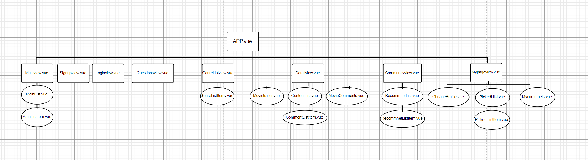

# front_end

## Project setup
```
npm install
```

### Compiles and hot-reloads for development
```
npm run serve
```

### Compiles and minifies for production
```
npm run build
```

### Lints and fixes files
```
npm run lint
```

### Customize configuration
See [Configuration Reference](https://cli.vuejs.org/config/).


# 11/17
1. 사이트맵 설계도 작성하기
 

 2. Mainpage 상단 부분 슬라이드에 나올 영화 출력하기
 - axios를 통해 데이터를 받아 데이터들 중에서 필요한 요소들만 추출하여 state에 정의해놓은 빈 배열에 넣었다. 
 - lodash 중 samplesize를 이용하여 추출할 영화 범위를 구하고 v-for를 이용하여 영화 한개씩 보여주는 carousel 방식을 통해 첫 화면을 구성하였다. 

 3. 문제점
 - img 사이즈를 url에 포함시켜서 width를 따로 지정해도 사이즈를 변하지 않는 문제점이 생겼다. 